# Software Architecture Practice Exercises - Week 8: DOCKER COMPOSE

## Submission Information

- **Full Name**: Dương Hoàng Lan Anh
- **Student ID**: 21087481

---

## PART 2: Docker Compose file

### Exercise 01: Run a simple container with Docker Compose

#### Launch Docker container

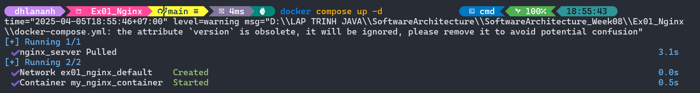

#### Check Docker container status:

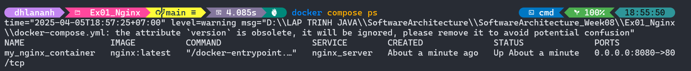

#### Test:

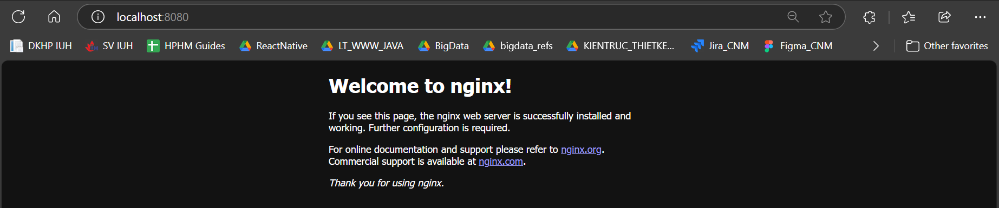

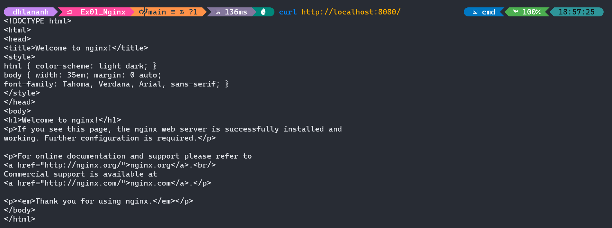

#### Stop and remove the container:

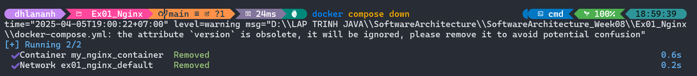

### Exercise 04: Run a simple Node.js app with Express using Docker Compose.

#### Launch Docker container

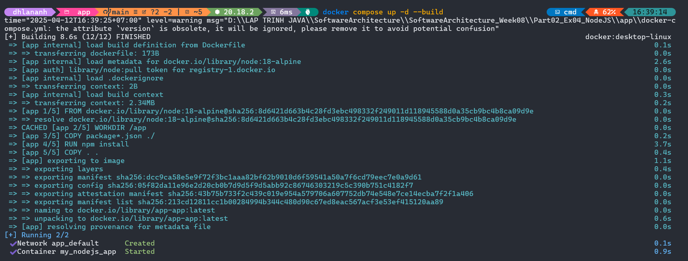

#### Check Docker container status:

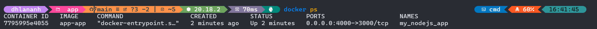

#### Test:

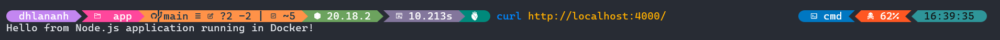

#### Stop and remove the container:

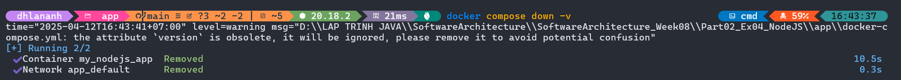

### Exercise 05: Run Redis application with Docker Compose

#### Launch Docker container

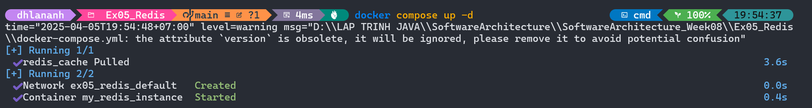

#### Check Docker container status:

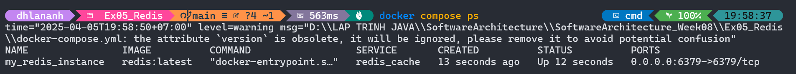

#### Test:

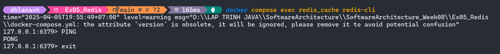

#### Stop and remove the container:

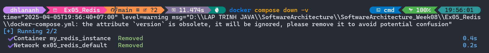

### Exercise 06: Run WordPress with MySQL using Docker Compose.

#### Launch Docker container

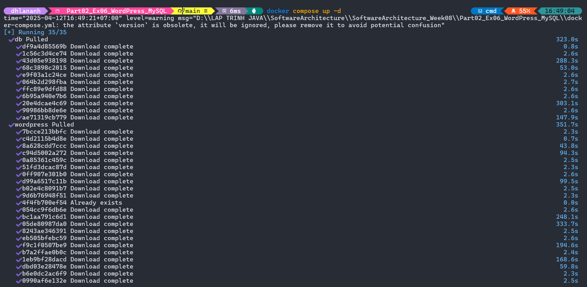

#### Check Docker container status:

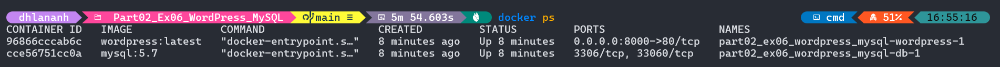

#### Test:

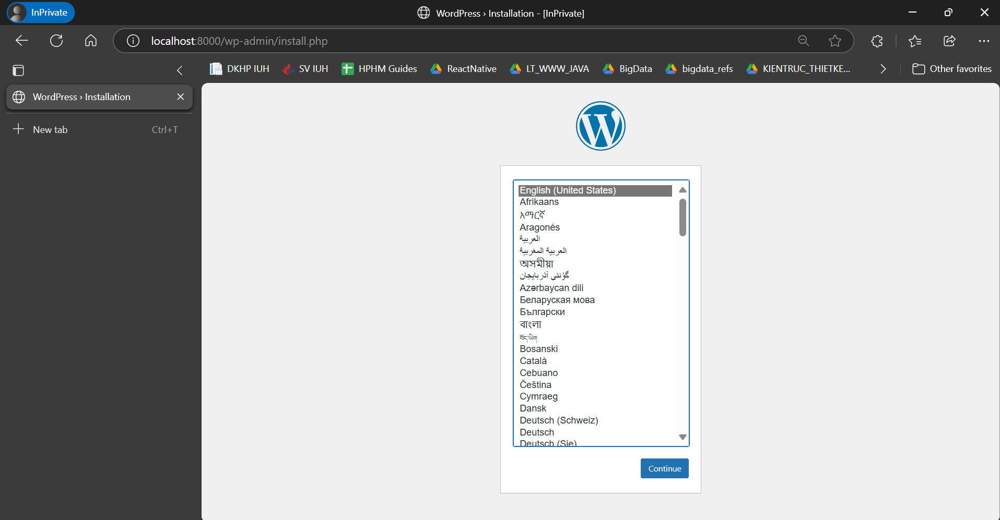

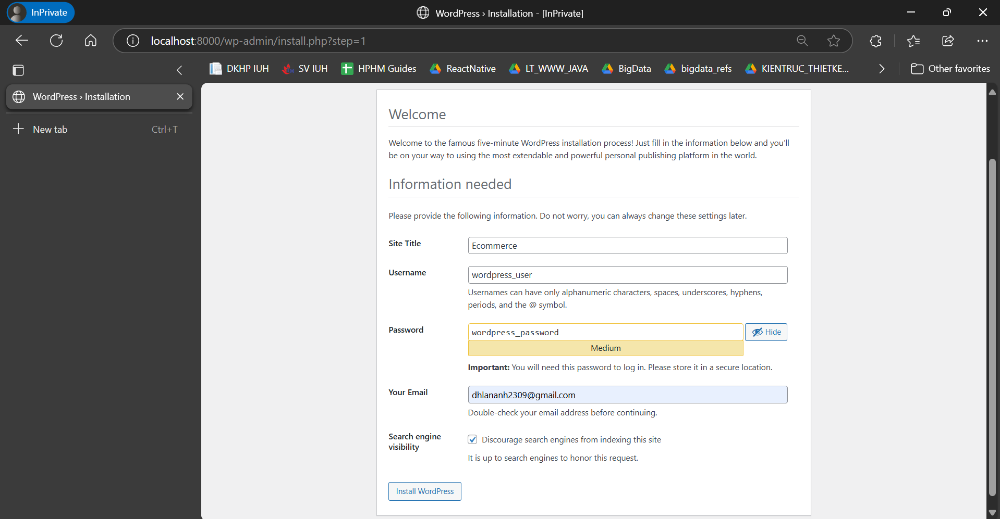

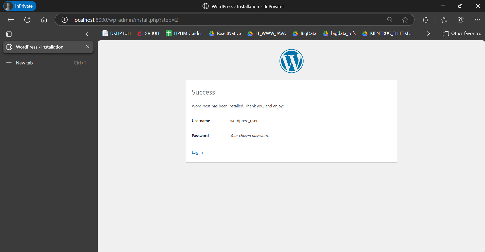

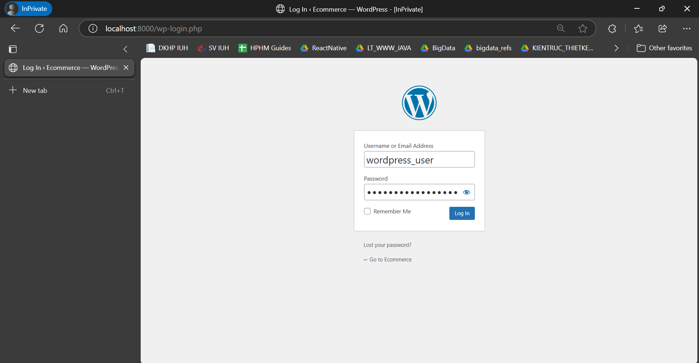

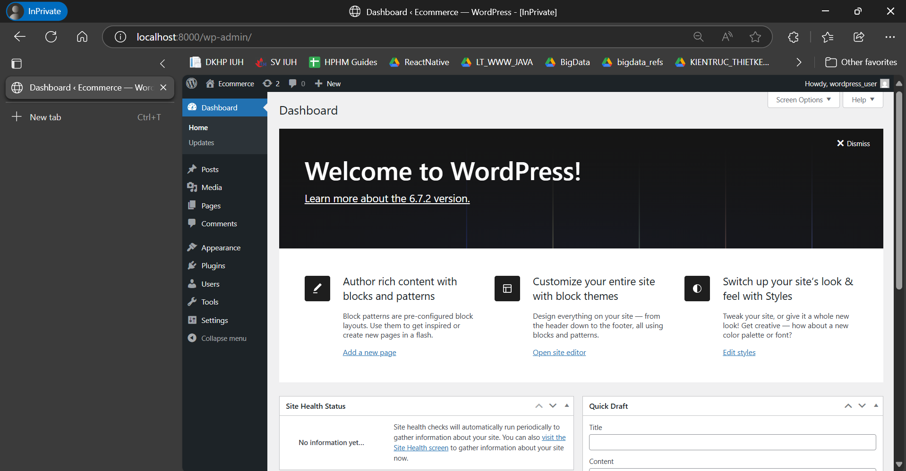

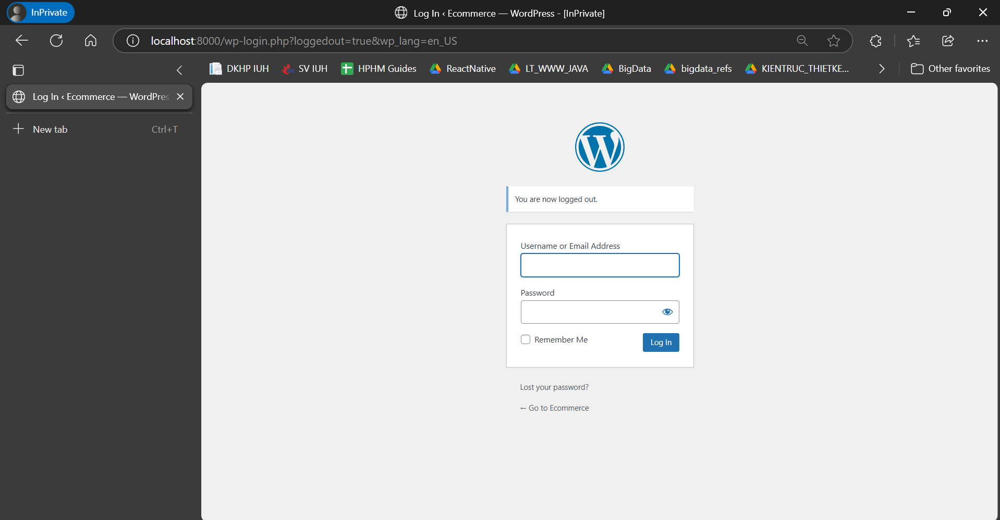

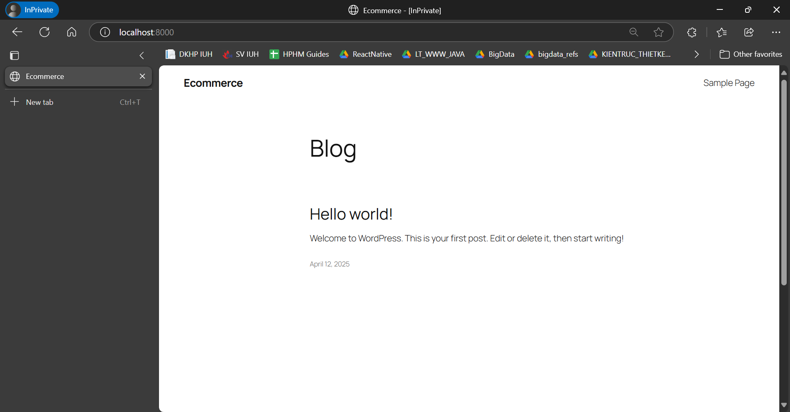

#### Stop and remove the container:

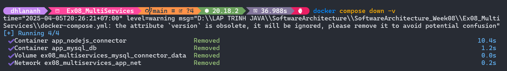

### Exercise 08: Connect multiple services with Docker Compose

#### Launch Docker container

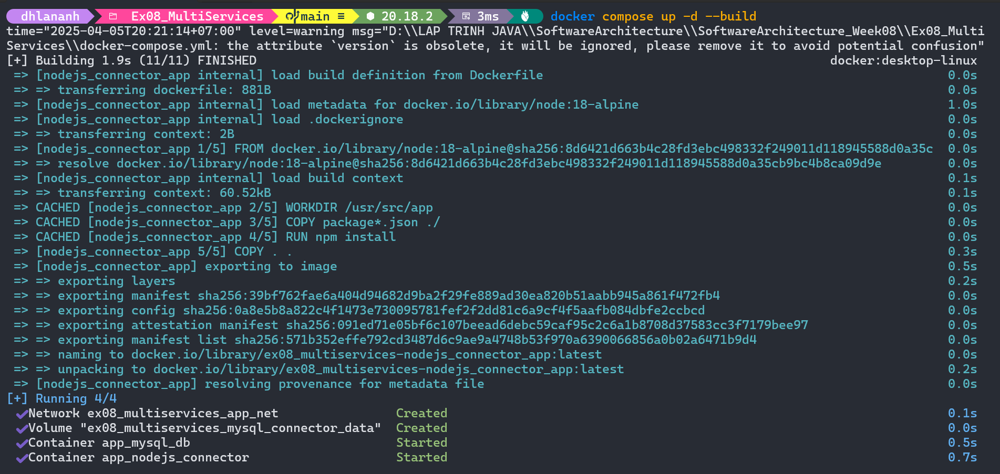

#### Check Docker container status:

#### Test:

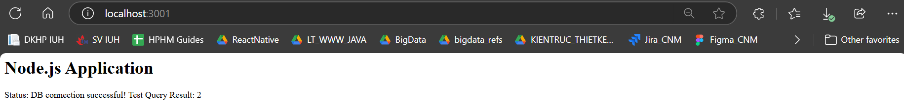

#### Stop and remove the container:

### Exercise 09: Running Python Flask Applications with Docker Compose

#### Launch Docker container

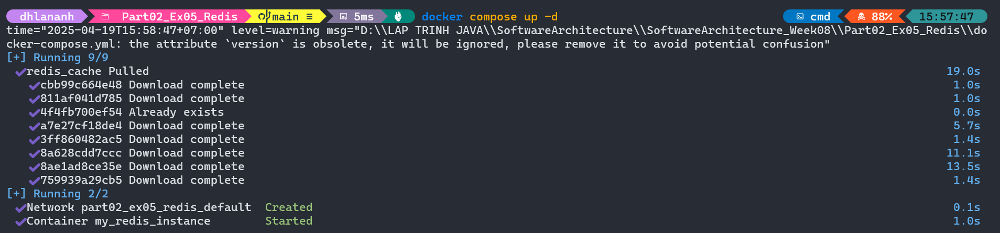

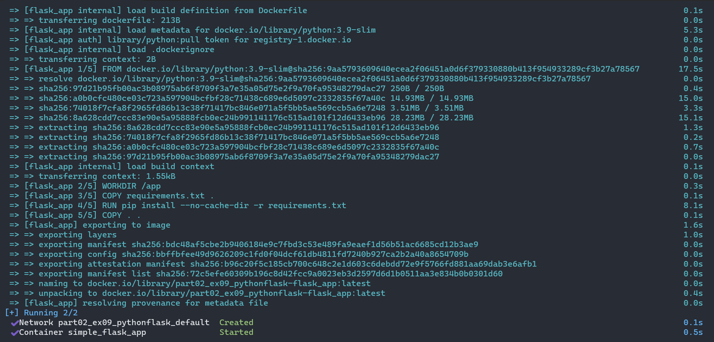

#### Test:

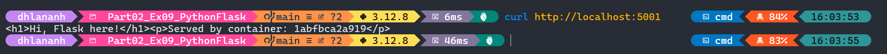

#### Stop and remove the container:

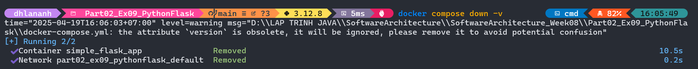

### Exercise 10: Store data with Docker Volumes

#### Launch Docker container

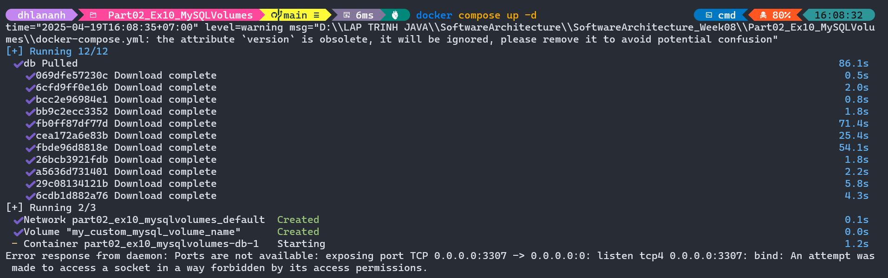

#### Test:

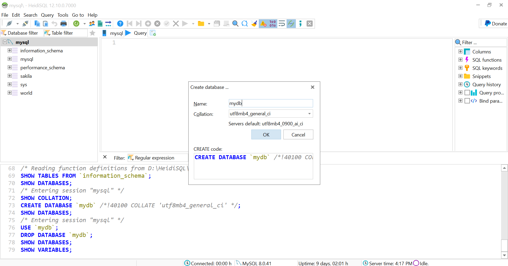

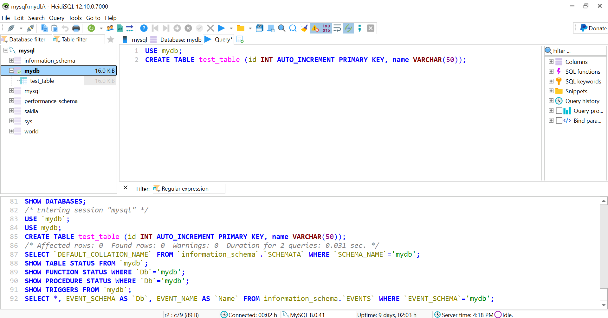

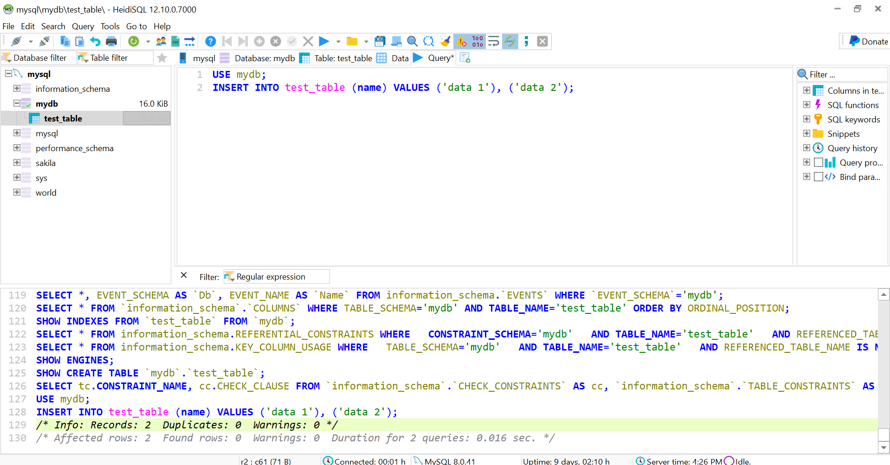

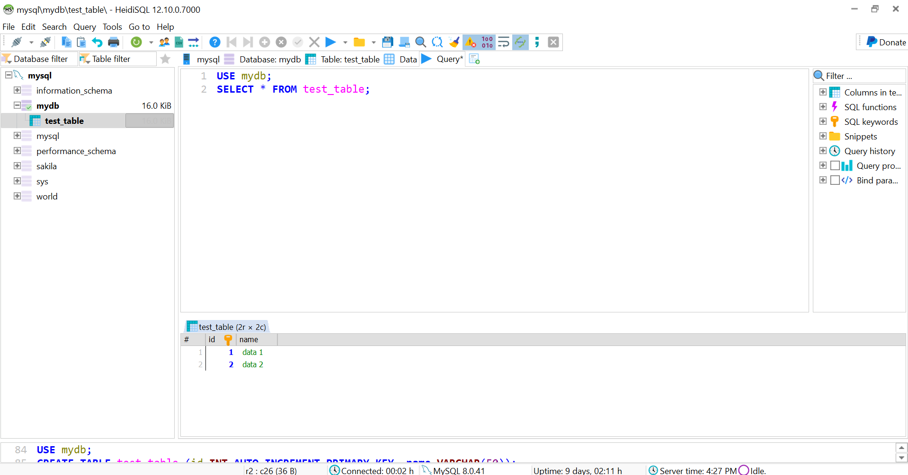

#### Stop and remove the container:

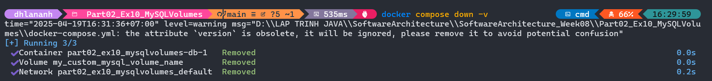
